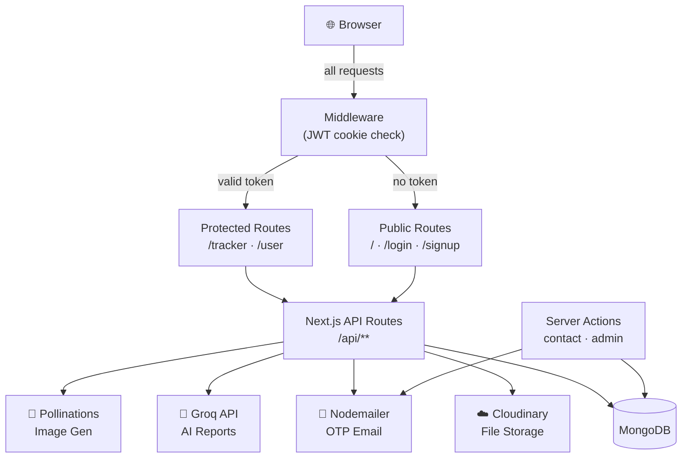

# 💰 Bizdhan

### All-in-one finance management for individuals & small businesses

[](https://nextjs.org/)
[](https://react.dev/)
[](https://www.typescriptlang.org/)
[](https://mongodb.com/)
[](https://tailwindcss.com/)
[](https://cloudinary.com/)

---

## 📖 Overview

Bizdhan is a unified finance platform that eliminates the need for separate tools for personal and business money. Users choose a workspace type at signup (Personal, SME, or Both) and get a tailored dashboard for tracking income, expenses, investments, invoices, and purchases — all backed by AI-generated reports powered by Groq.

---

## ✨ Features

### 🌐 Marketing & Public
- Landing page with hero, features, testimonials, FAQ, contact form, and footer
- Light / dark / system theme toggle (next-themes)
- Lenis smooth scrolling + custom cursor animation

### 🔐 Auth & Account
- Signup with workspace mode selection: **Personal**, **SME**, or **Both**
- JWT cookie sessions (httpOnly, jose-signed)
- Forgot password → OTP email → reset flow (Nodemailer)
- Profile management with Cloudinary image upload
- User dashboard at `/user`

### 📊 Personal Finance Tracker
- Income tracking (CRUD)
- Expense tracking (CRUD)
- Investment tracking (CRUD)
- AI-generated finance report (Groq LLM)

### 🏢 SME Finance Tracker
- Purchase management (CRUD)
- Invoice creation + PDF download (jsPDF)
- Cash runway, financial health score, spending leaks, overdue invoices summary
- AI-generated business report (Groq LLM)

### 🤖 AI & Utilities
- AI image generation via Pollinations API
- Cloudinary file upload / delete / folder management
- OCR component (Tesseract.js — available, not yet wired to a page)

### 🛡️ Admin / Moderator
- Analytics dashboard at `/admin`
- Paginated user management (create / edit / delete) at `/admin/users`
- Moderator mirror at `/moderator`

---

## 🗂️ Project Structure

```
bizdhan/
├── app/
│   ├── (auth)/           # login, signup, forgot/reset password
│   ├── tracker/          # authenticated finance UI (personal + SME)
│   ├── admin/            # admin analytics + user management
│   ├── moderator/        # moderator dashboard
│   ├── ai/generate/      # AI image generation page
│   └── api/              # all route handlers (auth, tracker, files, ai)
├── components/
│   ├── ui/               # Radix UI + shadcn primitives
│   ├── home/             # landing page sections
│   ├── tracker/          # finance UI components
│   ├── admin/            # admin UI components
│   └── custom/           # data table, OCR, etc.
├── lib/                  # DB, JWT, email, Cloudinary, Groq, PDF, math
├── types/                # TypeScript models (user, workspace, finance)
├── constants/            # nav configs, marketing copy, location lists
├── hooks/                # e.g. use-mobile.ts
└── middleware.ts         # JWT guard for /user/* and /tracker/*
```

---

## 🏗️ Architecture



---

## 🛠️ Tech Stack

| Category | Technology |
|----------|-----------|
| Framework | Next.js 15.5.2 (App Router) |
| Language | TypeScript 5 |
| UI Library | React 19.1.0 |
| Styling | Tailwind CSS v4, tw-animate-css |
| Components | Radix UI, shadcn/ui setup, Lucide icons |
| Animation | Framer Motion, Lenis smooth scroll |
| Forms | react-hook-form + Zod 4 |
| Tables | TanStack React Table |
| Charts | Recharts |
| Toast / Drawer | Sonner, Vaul |
| Database | MongoDB (native driver, no ORM) |
| Auth | bcryptjs + JWT (jose) + httpOnly cookie |
| Email | Nodemailer (OTP + contact form) |
| File Storage | Cloudinary SDK |
| AI Reports | Groq (OpenAI-compatible, llama-3.1-70b) |
| Image Gen | Pollinations API |
| PDF | jsPDF |
| OCR | Tesseract.js (available, not yet routed) |

---

## ⚙️ Getting Started

### Prerequisites
- Node.js 18+
- pnpm (recommended) or npm
- MongoDB instance (local or Atlas)
- Accounts: Cloudinary, Groq, an SMTP email provider

### Installation

```bash
git clone https://github.com/Dhruv-Savaliya/BizDhan.git
cd BizDhan
pnpm install
```

### Environment setup

```bash
cp .env.example .env.local
```

Open `.env.local` and fill in all values (see Environment Variables below).

> ⚠️ The app will throw at startup if any `EMAIL_*` variable is missing — Nodemailer is required for OTP.

### Run locally

```bash
pnpm dev
# → http://localhost:3000
```

### Other commands

```bash
pnpm build    # production build
pnpm start    # run production build
pnpm lint     # ESLint check
```

---

## 🔑 Environment Variables

### Required (app will not start without these)

| Variable | Purpose |
|----------|---------|
| `MONGODB_URI` | MongoDB connection string |
| `MONGODB_DB_NAME` | Database name |
| `JWT_SECRET` | Primary JWT signing secret |
| `EMAIL_HOST` | SMTP host for OTP emails |
| `EMAIL_PORT` | SMTP port |
| `EMAIL_USER` | SMTP username |
| `EMAIL_PASS` | SMTP password |
| `EMAIL_FROM` | Sender address for OTP emails |

### Required for full functionality

| Variable | Purpose |
|----------|---------|
| `CLOUDINARY_CLOUD_NAME` | Cloudinary cloud name |
| `CLOUDINARY_API_KEY` | Cloudinary API key |
| `CLOUDINARY_API_SECRET` | Cloudinary API secret |
| `GROQ_API_KEY` | Groq API key for AI reports |

### Optional

| Variable | Default | Purpose |
|----------|---------|---------|
| `RECEIPT_LLM_MODEL` | `llama-3.1-70b-versatile` | Groq model for tracker reports |
| `AUTH_SECRET` / `NEXTAUTH_SECRET` | — | Alternate JWT verify secrets |
| `POLLINATIONS_BASE_URL` | `https://image.pollinations.ai` | Image gen base URL |
| `POLLINATIONS_MODEL` | `flux` | Image generation model |
| `POLLINATIONS_DEFAULT_WIDTH` | — | Default image width |
| `POLLINATIONS_DEFAULT_HEIGHT` | — | Default image height |
| `SMTP_HOST/PORT/USER/PASS/FROM/TO` | — | Separate SMTP for contact form |
| `APP_NAME` | — | "From" display name in emails |
| `NODE_ENV` | — | Sets secure cookie in production |

---

## 📡 API Reference

### Auth

| Method | Endpoint | Description | Auth |
|--------|----------|-------------|------|
| `POST` | `/api/auth/signup` | Create user + workspaces, set JWT cookie | No |
| `POST` | `/api/auth/login` | Verify credentials, set JWT cookie | No |
| `POST` | `/api/auth/signout` | Clear session cookie | No |
| `POST` | `/api/auth/forgot-password` | Send OTP to email | No |
| `POST` | `/api/auth/verify-otp` | Verify OTP code | No |
| `POST` | `/api/auth/reset-password` | Reset password with valid OTP | No |
| `GET` | `/api/auth/me` | Get current user JSON | Cookie |

### Tracker

| Method | Endpoint | Description |
|--------|----------|-------------|
| `GET/POST` | `/api/tracker/income` | List / create income entries |
| `GET/POST` | `/api/tracker/expense` | List / create expense entries |
| `GET/POST` | `/api/tracker/invest` | List / create investments |
| `GET/POST` | `/api/tracker/purchase` | List / create purchases (SME) |
| `GET/POST` | `/api/tracker/invoice` | List / create invoices (SME) |
| `GET` | `/api/tracker/summary` | Aggregated stats, runway, health score, leaks, overdue |
| `POST` | `/api/tracker/report` | Generate AI narrative report via Groq |

### Files

| Method | Endpoint | Description |
|--------|----------|-------------|
| `POST` | `/api/files/upload` | Upload file to Cloudinary (multipart) |
| `POST` | `/api/files/delete` | Delete asset by Cloudinary `publicId` |
| `POST` | `/api/files/delete-folder` | Delete Cloudinary folder + all resources |

### AI

| Method | Endpoint | Description |
|--------|----------|-------------|
| `POST` | `/api/ai/generate` | Generate image URL via Pollinations |

---

## 🚀 Deployment

Bizdhan is a standard Next.js app with no custom server — deploy anywhere that runs Node.js.

**Vercel (recommended)**
1. Push to GitHub
2. Import repo in Vercel dashboard
3. Add all environment variables in Vercel project settings
4. Deploy — Vercel auto-runs `next build`

**Self-hosted (VPS / Docker)**
```bash
pnpm build
pnpm start   # runs next start on port 3000
```

Make sure all `EMAIL_*`, `MONGODB_URI`, and `JWT_SECRET` env vars are set before starting.

---

## 🤝 Contributing

1. Fork the repository
2. Create a feature branch: `git checkout -b feature/your-feature`
3. Make your changes and commit: `git commit -m "feat: add your feature"`
4. Push to your branch: `git push origin feature/your-feature`
5. Open a Pull Request

---

## 📄 License

MIT License — see [LICENSE](LICENSE) for details.

---

  Built with Next.js, MongoDB, and Groq AI

---
